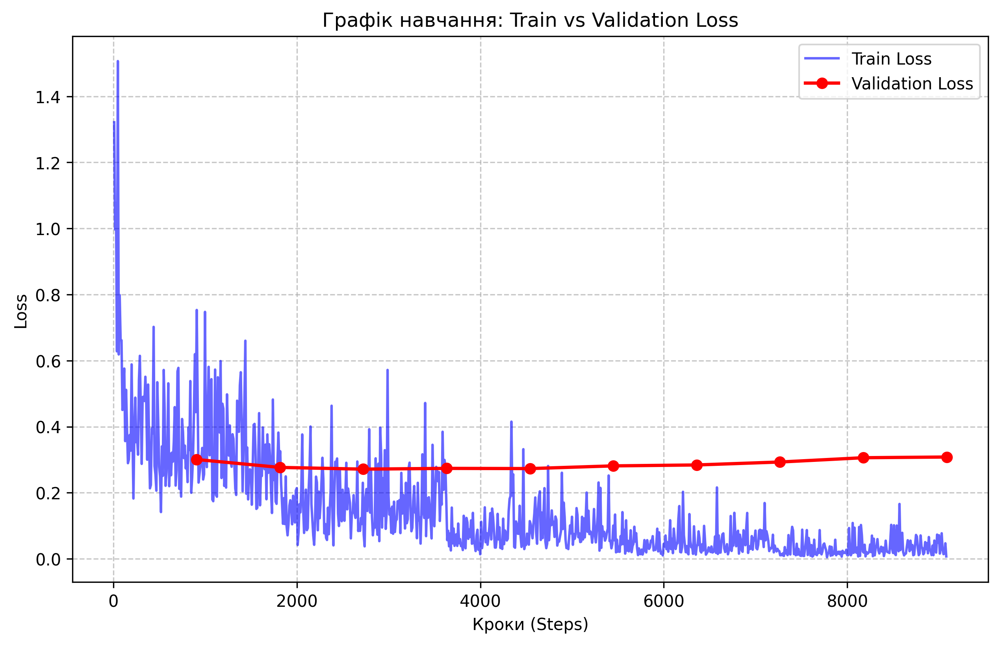

# Homework 3
**Korets Khrystyna, Sampara Sofiia, Popeniuk Sofiia**

## Data Overview, Key Characteristics, and Issues
The dataset by Ukrainian media asset ‘Toronto Television’ was prepared for Ukrainian speech-to-text task and contains 18,145 valid audio–text pairs after preprocessing, with a total duration of about 30.03 hours. Audio was standardized to 16 kHz and split by speakers into train/validation/test (14,530 / 1,613 / 2,002). The normalized vocabulary contains 34 symbols, including Ukrainian-specific letters.

During preprocessing, we addressed these data issues:
* Removed samples with missing audio files.
* Removed samples with empty transcripts.
* Removed samples whose transcript became empty after text normalization.
* Filtered out audio with invalid duration (too short/too long).
* Filtered out likely text–audio mismatches using characters-per-second thresholds.
    * Character rate is the number of transcript characters (usually excluding spaces) spoken per second of audio, used to detect likely text-audio mismatches that are unrealistically fast or slow. Here, the character-rate threshold is 0.5 to 35.0 characters/second.

This produced a cleaner, consistent dataset suitable for Whisper fine-tuning.

### Main data issues identified during preprocessing:
| Issue | Count / Details |
| :--- | :--- |
| **Missing audio files** | 10,929 referenced files were not found |
| **Empty transcripts** | 104 samples had empty text |
| **Normalization to empty** | 35 transcripts became empty after text cleaning |
| **Duration outliers** | 1 sample was outside allowed duration limits |
| **Text–audio mismatch risk** | 18 samples had invalid character-rate values |

---

## Model
We used **OpenAI's Whisper Small** as the base model — a multilingual speech-to-text transformer pretrained on 680,000 hours of audio. It was chosen as a balance between model size (244M parameters) and transcription quality, being small enough to fine-tune on a single GPU while still producing competitive results on Ukrainian speech.

Fine-tuning was implemented using **PyTorch Lightning**. The model was trained for 5 epochs with a batch size of 8, using AdamW optimizer with a learning rate of 1e-5 and 16-bit mixed precision (fp16) to reduce memory usage. The model was forced to always transcribe in Ukrainian by setting forced decoder ids via the processor. A `ModelCheckpoint` callback saved the best model based on validation WER, and `EarlyStopping` halted training if validation WER did not improve for 3 consecutive epochs.

Audio was preprocessed in Part 1: converted to 16 kHz mono WAV, normalized text was tokenized using the Whisper tokenizer. During training, audio was transformed into 80-channel mel spectrograms of fixed size (80×3000), which is the standard input format for Whisper.

---

### Training Dynamics

The figure below illustrates the training and validation loss over the course of the fine-tuning process.

**Key Observations:**
*  The training loss (blue) shows a consistent and sharp decline, indicating that the model effectively learned the specific acoustic features of the Ukrainian dataset.
*  The validation loss (red) reached its minimum at approximately step 4,000. Beyond this point, a slight divergence between the training and validation curves is observed, which is a classic sign of overfitting.
*  To ensure the highest quality of transcription, the training process utilized a `ModelCheckpoint` callback. This allowed us to ignore the overfitted later stages and automatically select the weights from the epoch with the lowest `val/wer`, resulting in the superior performance documented in the results section.

---

## Evaluation
The model was evaluated on the validation split during training using two standard speech recognition metrics — **WER (Word Error Rate)** and **CER (Character Error Rate)**. WER measures the percentage of words that were predicted incorrectly, while CER does the same at the character level. Lower values mean better performance.

### Validation Results (after 5 epochs):
| Metric | Value |
| :--- | :--- |
| **val/WER** | 0.190 |
| **val/CER** | 0.058 |
| **train/loss** | 0.094 |

---

## Testing Results and Quality Assessment
To evaluate the performance of the fine-tuned Whisper Small model, a held-out test set was used. This set consists of speakers who were not included in the training process, allowing for an assessment of the model's generalization capabilities in a speaker-independent STT (Speech-to-Text) scenario.

### Metrics Table
| Metric | Value | Description |
| :--- | :--- | :--- |
| **WER (Word Error Rate)** | 28.93% | Percentage of errors at the word level |
| **CER (Character Error Rate)** | 12.01% | Percentage of errors at the individual character level |
| **COMET Score** | 0.8081 | Semantic similarity score (ranging from 0 to 1) |

---

### Results Comparison (Baseline vs. Fine-tuned)

To evaluate the effectiveness of our fine-tuning, we compared the performance of our final model against the base `openai/whisper-small` version (without additional training) using a held-out test set.

| Model | WER (%) ↓ | CER (%) ↓ | COMET ↑ |
| :--- | :--- | :--- | :--- |
| **Baseline** (`openai/whisper-small`) | 42.37 | 20.85 | 0.7523 |
| **Fine-tuned** (Our model) | **28.93** | **12.01** | **0.8081** |

Comparing our model with the pre-trained weights demonstrates an improvement in speech recognition quality after fine-tuning:

1. **Substantial reduction in word and character-level errors:** The Word Error Rate (WER) decreased by **13.44%** (from 42.37% to 28.93%), and the Character Error Rate (CER) dropped by nearly half, showing an **8.84%** improvement (from 20.85% to 12.01%). This indicates that the model is much less prone to confusing individual letters and words, having successfully adapted to the phonetics of the target dataset.
2. **Improvement in semantic accuracy:** The increase in the COMET score (from 0.7523 to 0.8081) confirms that the generated text has become not only phonetically more accurate but also more coherent and semantically closer to the original transcriptions.
3. **Generalization capability:** Because the evaluation was conducted on speakers who were excluded from the training phase (speaker-independent STT), these results prove that the model did not merely memorize the training data. Instead, it genuinely improved its overall ability to recognize and transcribe Ukrainian speech.

---

## Analysis of Results and Hypotheses
The results demonstrate a specific pattern often observed in complex audio datasets involving spontaneous speech (such as the Toronto Dataset).

### Key Findings and Hypotheses:

1.  **The Gap Between WER and CER:**
    * The relatively low CER (12.01%) indicates that the acoustic model has successfully learned to recognize the phonemes of the Ukrainian language. The model rarely makes "phonetic" mistakes in how it hears the sounds.
    * The higher WER (28.93%) compared to the CER suggests that errors are often concentrated within words (e.g., incorrect grammatical endings, case forms, or the spelling of proper nouns). Since WER marks an entire word as incorrect even if only one letter is wrong, this sensitivity leads to a higher error rate.

2.  **High Semantic Accuracy (COMET = 0.8081):**
    * A COMET score above 0.8 is a critical argument for the model's success. It confirms the hypothesis that the model effectively preserves the meaning of the utterance.
    * Most of the model's errors are "surface-level" (e.g., substituting synonyms like "і" for "та", or minor punctuation mismatches compared to the original_text). For an end-user, the transcribed text remains highly intelligible and useful.

3.  **Impact of Dataset Specifics (Toronto Dataset):**
    * **Hypothesis:** The WER is partially inflated due to non-standard vocabulary (galytska govirka), specific terminology used by Michael Shchur, and a rapid speaking pace. Despite its compact size, the Whisper Small model adapted well to these conditions through the fine-tuning stage.

### Hypothesis for Future Improvement:
To further reduce the WER, we can either increase the volume of training data or utilize a larger version of the model (Whisper Medium). A larger model possesses a more robust internal language model, which would better correct grammatical inconsistencies in the final output.
